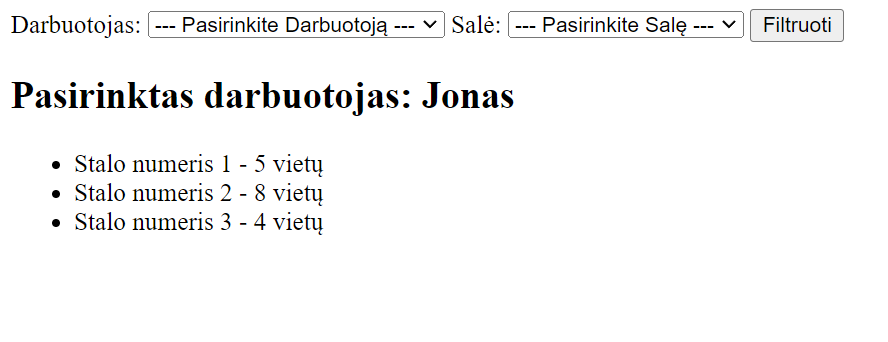

# Restoranai Demo - Django Projekto Dokumentacija

## Pradžios Nurodymai

## Projektas Parsisiuntimas Naudodami Git

Pirma, turite parsisiųsti projektą į savo lokalų kompiuterį. Naudojant Git, tai galite padaryti šia komanda:

```bash
git clone https://github.com/GytBalt5/restoranai-demo.git
```

## Arba galite tiesiog atsisiųsti projekto ZIP failą

Eikite į projekto GitHub puslapį.
Spustelėkite Code mygtuką, esantį puslapio viršuje.
Pasirinkite Download ZIP.
Išsaugokite ir išarchyvuokite failą pasirinktoje direktorijoje.

## Įdiegimas ir Nustatymas

## 1. Python Virtualios Aplinkos Sukūrimas

Pirma, turite sukurti Python virtualią aplinką (venv) projekto šakninėje direktorijoje. Tai galite padaryti naudodami šią komandą:

```bash
python -m venv .venv
```

## 2. Virtualios Aplinkos Aktyvavimas

Aktyvuokite sukurtą virtualią aplinką naudodami šią komandą Windows sistemoje:

```bash
.venv\Scripts\activate
```

## 3. Bibliotekų Įdiegimas

Įdiekite būtinas bibliotekas iš biblioteku-sarasas.txt failo naudodami šią komandą:

```bash
pip install -r biblioteku-sarasas.txt
```

## 4. Django Projekto Paleidimas

Prieš paleisdami projektą, atlikite duomenų bazės migracijas naudodami šias komandas:

```bash
python manage.py makemigrations
python manage.py migrate
```

Tada galite paleisti Django serverį naudodami:

```bash
python manage.py runserver
```

Projektas bus prieinamas per naršyklę adresu http://localhost:8000/.

## 5. Django Admin Super Vartotojo Sukūrimas

Sukurkite Django admin super vartotoją naudodami šią komandą:

```bash
python manage.py createsuperuser
```

Sekite komandinės eilutės instrukcijas, kad suvestumėte vartotojo vardą, el. paštą ir slaptažodį.

## 6. Naudojimasis Django Admin

Norėdami naudotis Django admin sąsaja, eikite į http://localhost:8000/admin ir prisijunkite naudodami anksčiau sukurtus super vartotojo prisijungimo duomenis. Čia galėsite tvarkyti projektą susijusius duomenis, pvz., vartotojus, modelių įrašus ir kt.


